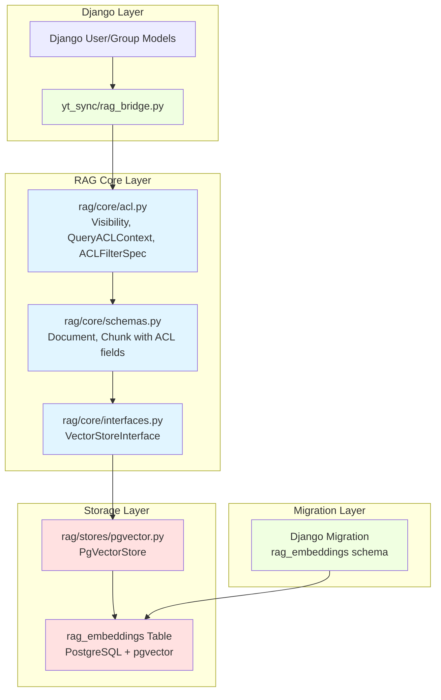
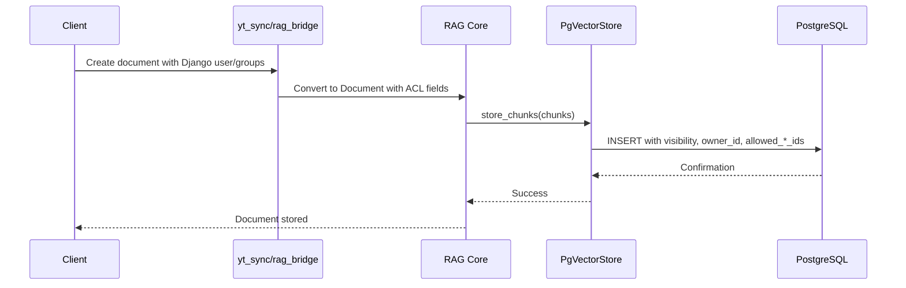
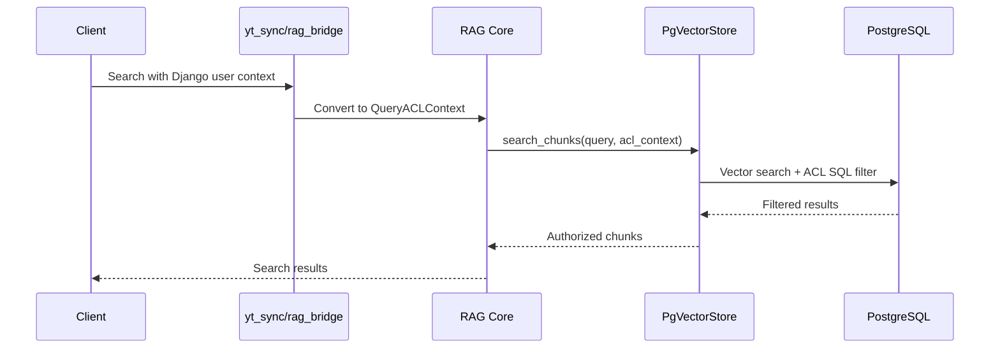

# TS-0001: RAG ACL Management Architecture

## Overview

This technical specification implements Access Control List (ACL) capabilities for the RAG (Retrieval-Augmented Generation) module. The implementation enables fine-grained access control for document chunks based on user permissions, groups, and visibility levels.

The architecture follows a layered approach with clear separation of concerns:
- **Core ACL Types**: Fundamental ACL concepts and schemas
- **Schema Extensions**: Integration of ACL fields into existing data models
- **Interface Extensions**: ACL-aware search and GDPR deletion capabilities
- **Vector Store Implementation**: Efficient ACL filtering using PostgreSQL/pgvector
- **Database Schema**: Optimized table structure with ACL columns and indexes
- **Django Integration**: Bridge layer connecting Django's auth system to RAG ACL

## Component Diagram



## Key Design Decisions

### 1. ACL Model Design

**Visibility Levels**:
- `PUBLIC`: Available to all users
- `AUTHENTICATED`: Requires authentication
- `GROUPS`: Restricted to specific groups
- `USERS`: Restricted to specific users
- `PRIVATE`: Owner-only access

**Rationale**: This hierarchy provides flexibility while maintaining simplicity. The enum-based approach ensures type safety and makes ACL logic explicit.

### 2. Database Schema Design

**ACL Columns**:
- `visibility`: Enum column for visibility level
- `owner_id`: UUID reference to content owner
- `allowed_user_ids`: JSONB array of user UUIDs
- `allowed_group_ids`: JSONB array of group IDs

**Rationale**: Using JSONB for arrays enables efficient PostgreSQL array operations and GIN indexing. Native SQL filtering provides better performance than application-level filtering.

### 3. Query Performance Optimization

**Indexing Strategy**:
- B-tree index on `visibility` for common filtering
- GIN indexes on `allowed_user_ids` and `allowed_group_ids` for array containment queries
- Composite index on frequently combined columns

**Rationale**: Indexes enable efficient ACL filtering even with millions of chunks. PostgreSQL's native array operations with GIN indexes provide optimal performance.

### 4. GDPR Compliance

**Deletion Capabilities**:
- `delete_by_user_id`: Remove all content owned by a user
- `delete_by_group_id`: Remove all content restricted to a group
- Cascade deletion support in Django migration

**Rationale**: GDPR "right to be forgotten" requires efficient user data deletion. Dedicated methods ensure complete removal of user-associated content.

### 5. Bridge Layer Pattern

**Django Integration**:
- Separate bridge module (`yt_sync/rag_bridge.py`) converts Django models to RAG ACL contexts
- No direct coupling between RAG core and Django

**Rationale**: Maintains RAG module independence. The bridge pattern allows RAG to be used with different auth systems or standalone.

### 6. Type Safety

**Pydantic Models**:
- All ACL types defined as Pydantic models
- Strict validation at API boundaries
- Type hints throughout

**Rationale**: Pydantic ensures data validation and serialization consistency. Type hints improve IDE support and catch errors early.

## File Structure

```
rag/
├── core/
│   ├── acl.py              # NEW: ACL types and contexts
│   ├── schemas.py          # MODIFIED: Add ACL fields
│   └── interfaces.py       # MODIFIED: Add ACL methods
├── stores/
│   └── pgvector.py         # NEW: PgVectorStore implementation
└── migrations/
    └── 0001_create_embeddings_table.py  # NEW: Database schema

yt_sync/
└── rag_bridge.py           # NEW: Django integration bridge

tests/
└── rag/
    └── test_acl.py         # NEW: Comprehensive test suite
```

## Data Flow

### Document Ingestion with ACL



### ACL-Filtered Search



## Security Considerations

1. **Default Deny**: Unknown users receive no results (empty set)
2. **SQL Injection Prevention**: All parameters use parameterized queries
3. **Ownership Validation**: Owner ID verified at storage time
4. **Array Operations**: PostgreSQL native operators prevent injection
5. **Visibility Enforcement**: Database-level filtering ensures no leakage

## Performance Characteristics

**Expected Performance**:
- ACL filtering adds <5ms overhead for typical queries
- GIN indexes provide O(log n) array containment checks
- Vector similarity search remains the bottleneck
- Scales to millions of chunks with proper indexing

**Optimization Opportunities**:
- Materialized views for common group combinations
- Partition tables by visibility level if needed
- Cache user group memberships in application layer

## Testing Strategy

The test suite (task-007) verifies:
1. **ACL Type Validation**: Pydantic model constraints
2. **Schema Integration**: Document/Chunk with ACL fields
3. **Query Filtering**: All visibility levels work correctly
4. **GDPR Deletion**: Complete user data removal
5. **Edge Cases**: Empty groups, non-existent users, etc.
6. **Performance**: Index usage and query efficiency
7. **Integration**: End-to-end with Django bridge

## Migration Path

**Zero-Downtime Deployment**:
1. Run migration to create `rag_embeddings` table
2. Deploy updated RAG code with ACL support
3. Existing code continues to work (ACL fields nullable initially)
4. Backfill ACL data for existing documents
5. Make ACL fields NOT NULL in follow-up migration

**Backward Compatibility**:
- Chunks without ACL data treated as PUBLIC
- Existing search API continues to work
- ACL context optional initially
