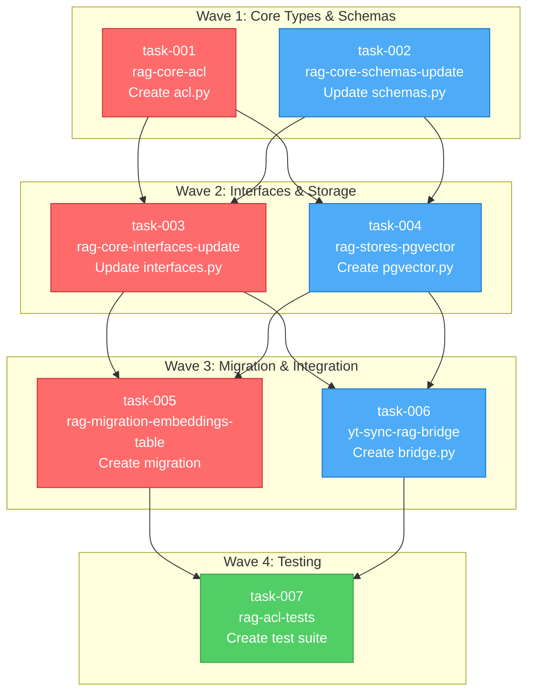

# TS-0001: RAG ACL Management Task Graph

## Wave Execution Plan

This task decomposition follows a 4-wave execution strategy with parallel execution within each wave.

## Critical Path

The critical path represents the longest dependency chain and determines minimum completion time:

**Critical Path**: `task-001 → task-003 → task-005 → task-007`

**Estimated Timeline**:
- Wave 1: 2-3 hours (parallel execution)
- Wave 2: 3-4 hours (parallel execution)
- Wave 3: 2-3 hours (parallel execution)
- Wave 4: 4-5 hours (comprehensive testing)

**Total Minimum Time**: ~11-15 hours (assuming optimal parallel execution)

## Wave Breakdown

### Wave 1: Foundation Layer

**Objective**: Establish core ACL types and update existing schemas

**Tasks**:
- `task-001`: Create `rag/core/acl.py` with ACL types
- `task-002`: Update `rag/core/schemas.py` with ACL fields

**Parallelization**: These tasks are fully independent and can run simultaneously.

**Output Contracts**:
- `Visibility` enum
- `QueryACLContext` model
- `ACLFilterSpec` model
- Updated `Document` and `Chunk` schemas

**Estimated Time**: 2-3 hours

---

### Wave 2: Interface & Implementation Layer

**Objective**: Extend interfaces and implement vector store with ACL support

**Tasks**:
- `task-003`: Update `rag/core/interfaces.py` with ACL methods
- `task-004`: Create `rag/stores/pgvector.py` with PgVectorStore

**Dependencies**: Both tasks require Wave 1 completion (need ACL types and updated schemas)

**Parallelization**: These tasks can run in parallel after Wave 1.

**Output Contracts**:
- Extended `VectorStoreInterface` with ACL methods
- `PgVectorStore` implementation
- ACL-aware search logic
- GDPR deletion methods

**Estimated Time**: 3-4 hours

---

### Wave 3: Persistence & Integration Layer

**Objective**: Create database schema and Django integration

**Tasks**:
- `task-005`: Create Django migration for `rag_embeddings` table
- `task-006`: Create `yt_sync/rag_bridge.py` for Django integration

**Dependencies**: Both tasks require Wave 2 completion (need interfaces and store implementation)

**Parallelization**: These tasks can run in parallel after Wave 2.

**Output Contracts**:
- `rag_embeddings` table with ACL columns
- Optimized indexes (GIN, B-tree)
- Django-to-RAG ACL conversion functions
- User/Group context builders

**Estimated Time**: 2-3 hours

---

### Wave 4: Verification Layer

**Objective**: Comprehensive testing of all ACL functionality

**Tasks**:
- `task-007`: Create complete test suite for ACL functionality

**Dependencies**: Requires all previous waves (tests entire system)

**Parallelization**: Single task (cannot parallelize comprehensive integration testing)

**Output Contracts**:
- Unit tests for all ACL components
- Integration tests for search filtering
- GDPR deletion tests
- Performance benchmarks
- Edge case coverage

**Estimated Time**: 4-5 hours

## Dependencies Table

| Task | Depends On | Blocks | Wave | Parallelizable |
|------|------------|--------|------|----------------|
| task-001 | None | task-003, task-004 | 1 | Yes (with task-002) |
| task-002 | None | task-003, task-004 | 1 | Yes (with task-001) |
| task-003 | task-001, task-002 | task-005, task-006 | 2 | Yes (with task-004) |
| task-004 | task-001, task-002 | task-005, task-006 | 2 | Yes (with task-003) |
| task-005 | task-003, task-004 | task-007 | 3 | Yes (with task-006) |
| task-006 | task-003, task-004 | task-007 | 3 | Yes (with task-005) |
| task-007 | task-005, task-006 | None | 4 | No |

## Parallel Execution Strategy

### Maximum Parallelization

**Wave 1**: 2 agents in parallel
- Agent A: task-001 (rag-core-acl)
- Agent B: task-002 (rag-core-schemas-update)

**Wave 2**: 2 agents in parallel
- Agent A: task-003 (rag-core-interfaces-update)
- Agent B: task-004 (rag-stores-pgvector)

**Wave 3**: 2 agents in parallel
- Agent A: task-005 (rag-migration-embeddings-table)
- Agent B: task-006 (yt-sync-rag-bridge)

**Wave 4**: 1 agent
- Agent A: task-007 (rag-acl-tests)

**Resource Efficiency**: 2 concurrent agents for most of the work, reducing to 1 for final testing.

### Risk Mitigation

**Merge Conflicts**:
- Wave 1: No conflicts (different files)
- Wave 2: No conflicts (different files)
- Wave 3: No conflicts (different files)
- Wave 4: Single agent, no conflicts

**Contract Violations**:
- Each wave produces contracts consumed by next wave
- Contract validation happens at wave boundaries
- Early detection of integration issues

**Testing Coverage**:
- Wave 4 validates all previous work
- Each task includes basic validation tests
- Integration issues caught before final merge

## Verification Checklist

After each wave, verify:

**Wave 1 Completion**:
- [ ] `rag/core/acl.py` exists with Visibility enum
- [ ] `rag/core/schemas.py` includes ACL fields
- [ ] All Pydantic models validate correctly
- [ ] Type hints are complete

**Wave 2 Completion**:
- [ ] `VectorStoreInterface` has ACL methods
- [ ] `PgVectorStore` implements interface
- [ ] SQL queries use parameterized inputs
- [ ] ACL filtering logic is correct

**Wave 3 Completion**:
- [ ] Migration file created and valid
- [ ] Table schema matches design
- [ ] Indexes created correctly
- [ ] Bridge converts Django models correctly

**Wave 4 Completion**:
- [ ] All tests pass
- [ ] Coverage > 90%
- [ ] Performance benchmarks acceptable
- [ ] Documentation complete

## Rollback Strategy

**Wave Failure Handling**:
1. **Wave 1 Failure**: Delete created files, no migration needed
2. **Wave 2 Failure**: Revert Wave 2 changes, Wave 1 remains stable
3. **Wave 3 Failure**: Rollback migration, revert bridge code
4. **Wave 4 Failure**: Fix tests, code remains deployable

**Clean Rollback**:
- Each wave is a clean commit boundary
- Git worktrees isolate parallel work
- Integration verification before main merge

## Success Criteria

**Technical Completion**:
- All 7 tasks completed successfully
- Tests passing with >90% coverage
- Migration runs without errors
- No security vulnerabilities

**Functional Completion**:
- ACL filtering works for all visibility levels
- GDPR deletion removes all user data
- Performance overhead <5ms
- Django integration seamless

**Quality Gates**:
- Type checking passes (mypy)
- Linting passes (ruff)
- Security scan passes
- Code review approved
