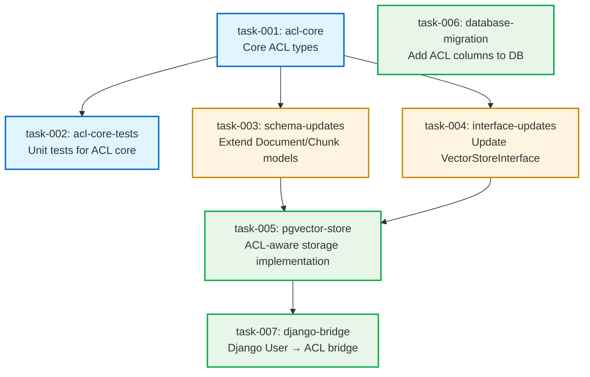

# Task Dependency Graph: TS-0001 RAG ACL Management

## Mermaid Diagram



## Wave Breakdown

### Wave 1: Foundation (Parallel Execution: 2 agents)
**Estimated Duration**: 45 minutes

| Task ID | Component | Agent | Duration | Can Start | Blocks |
|---------|-----------|-------|----------|-----------|--------|
| task-001 | acl-core | python-experts:django-expert | 30 min | Immediately | task-002, task-003, task-004 |
| task-002 | acl-core-tests | python-experts:python-testing-expert | 45 min | After task-001 | None |

**Wave Output**: Foundation ACL types (Visibility, QueryACLContext, ACLFilter) with unit tests

**Bottleneck**: task-001 is critical path - blocks all Wave 2 work

---

### Wave 2: Schema & Interface Updates (Parallel Execution: 2 agents)
**Estimated Duration**: 30 minutes

| Task ID | Component | Agent | Duration | Can Start | Blocks |
|---------|-----------|-------|----------|-----------|--------|
| task-003 | schema-updates | python-experts:django-expert | 30 min | After task-001 | task-005 |
| task-004 | interface-updates | python-experts:django-expert | 30 min | After task-001 | task-005 |

**Wave Output**: Extended Document/Chunk schemas and updated VectorStoreInterface with ACL methods

**Parallelization**: Both tasks depend only on task-001, can run simultaneously

---

### Wave 3: Implementation (Parallel Execution: 3 agents)
**Estimated Duration**: 60 minutes

| Task ID | Component | Agent | Duration | Can Start | Blocks |
|---------|-----------|-------|----------|-----------|--------|
| task-005 | pgvector-store | python-experts:django-expert | 60 min | After task-003, task-004 | task-007 |
| task-006 | database-migration | python-experts:django-expert | 20 min | Immediately* | None |
| task-007 | django-bridge | python-experts:django-expert | 45 min | After task-005 | None |

**Wave Output**: Fully functional ACL-aware RAG storage with Django integration

**Note**: task-006 has no code dependencies (schema known from Tech Spec), but should coordinate with task-005 to verify column names match implementation

---

## Critical Path Analysis

### Critical Path: task-001 → task-003 → task-005 → task-007
**Total Duration**: 165 minutes (2h 45m)

```
task-001 (30m) → task-003 (30m) → task-005 (60m) → task-007 (45m)
```

**Critical Path Tasks**:
1. **task-001** (acl-core): Foundation types - MUST complete first
2. **task-003** (schema-updates): Extends models - required for pgvector implementation
3. **task-005** (pgvector-store): Core storage logic - required for Django bridge
4. **task-007** (django-bridge): Final integration piece

**Optimization Opportunities**:
- task-006 (migration) can start early - reduce to 20m with clear schema spec
- task-002 (tests) runs parallel to Wave 2 - no impact on critical path
- task-004 (interface) runs parallel to task-003 - no impact on critical path

### Non-Critical Paths

**Path A: task-001 → task-004 → task-005**
Duration: 120 minutes (runs parallel to task-003 → task-005)

**Path B: task-001 → task-002**
Duration: 75 minutes (testing path - parallel to main implementation)

**Path C: task-006 (standalone)**
Duration: 20 minutes (can start immediately, completes before Wave 3)

---

## Parallelization Summary

| Wave | Parallel Agents | Duration | Efficiency |
|------|----------------|----------|------------|
| Wave 1 | 2 agents | 45 min | 100% (task-001 blocks, task-002 runs after) |
| Wave 2 | 2 agents | 30 min | 100% (both tasks fully parallel) |
| Wave 3 | 3 agents | 60 min | 80% (task-006 completes early, task-007 waits on task-005) |

**Overall Stats**:
- Sequential execution time: ~255 minutes (4h 15m)
- Parallel execution time: ~135 minutes (2h 15m)
- Speedup: 1.9x
- Peak parallelization: 3 agents (Wave 3)

---

## Execution Strategy

### Recommended Agent Allocation

**Wave 1**:
- Agent 1: task-001 (acl-core) - CRITICAL PATH
- Agent 2: Waits, then task-002 (tests) after task-001

**Wave 2** (after task-001 completes):
- Agent 1: task-003 (schema-updates) - CRITICAL PATH
- Agent 2: task-004 (interface-updates)

**Wave 3** (after task-003 & task-004 complete):
- Agent 1: task-005 (pgvector-store) - CRITICAL PATH
- Agent 2: task-006 (migration) - starts immediately, completes early
- Agent 3: task-007 (django-bridge) - waits for task-005

### Risk Mitigation

**Risk**: task-005 is complex (60 min) and blocks task-007
**Mitigation**: Ensure task-005 agent has clear contracts from task-003/task-004

**Risk**: task-006 schema mismatch with task-005 implementation
**Mitigation**: task-006 uses explicit column names from Tech Spec; task-005 validates against migration

**Risk**: task-002 tests may reveal ACL logic issues
**Mitigation**: task-002 agent reports failures immediately; Wave 2 can adapt if needed

---

## Integration Checkpoints

### Checkpoint 1: After Wave 1
**Verify**: ACL core types are complete and tested
**Artifacts**: `rag/core/acl.py`, test coverage report

### Checkpoint 2: After Wave 2
**Verify**: Schemas and interfaces match ACL core types
**Artifacts**: `rag/core/schemas.py`, `rag/core/interfaces.py`, type checking passes

### Checkpoint 3: After Wave 3
**Verify**: Full integration - ACL filtering works end-to-end
**Artifacts**: `rag/stores/pgvector.py`, `yt_sync/rag_bridge.py`, migration file, integration test passes

---

## Estimated Completion Times

| Metric | Time |
|--------|------|
| First deliverable (task-001) | +30 min |
| 50% tasks complete | +75 min |
| All tasks complete | +135 min |
| Integration verified | +150 min |

**Target**: Full TS-0001 implementation in **2.5 hours** with parallel execution
