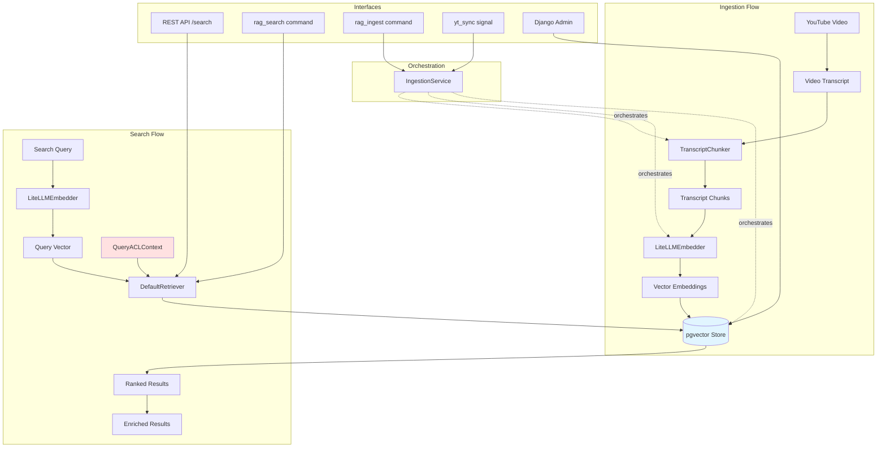

# Architecture: RAG Transcript Ingestion (TS-0002)

## Overview

This architecture implements a RAG (Retrieval-Augmented Generation) pipeline for YouTube video transcript ingestion and semantic search. The system processes video transcripts, chunks them intelligently based on timestamp gaps, generates embeddings using LiteLLM, stores them in pgvector, and provides semantic search capabilities with ACL enforcement.

## Component Diagram



## Components

### Core Components

#### TranscriptChunker (`rag/chunkers/transcript.py`)
- **Purpose**: Intelligently chunk video transcripts based on timestamp gaps
- **Algorithm**:
  - Analyzes timestamp gaps between transcript segments
  - Creates chunks when gaps exceed configurable threshold (default: 2 seconds)
  - Preserves semantic continuity while respecting natural breaks
- **Input**: Video transcript with timestamps
- **Output**: List of text chunks with metadata (start_time, end_time)
- **Configuration**: `RAG_CHUNKING_GAP_THRESHOLD`

#### LiteLLMEmbedder (`rag/embedders/litellm.py`)
- **Purpose**: Generate vector embeddings using LiteLLM library
- **Models**:
  - Local: `nomic-ai/nomic-embed-text-v1.5` (default, no API key required)
  - OpenAI: `text-embedding-3-small` or `text-embedding-3-large`
- **Features**:
  - Batch processing support
  - Automatic model selection based on configuration
  - Caching layer for repeated queries
- **Configuration**: `RAG_EMBEDDING_MODEL`, `RAG_EMBEDDING_DIMENSIONS`

#### RAG Configuration (`rag/config.py`)
- **Purpose**: Centralized configuration management
- **Settings**:
  - `RAG_EMBEDDING_MODEL`: Model identifier for embeddings
  - `RAG_EMBEDDING_DIMENSIONS`: Vector dimension (384 for nomic, 1536 for OpenAI)
  - `RAG_CHUNKING_GAP_THRESHOLD`: Timestamp gap threshold in seconds
  - `RAG_SEARCH_TOP_K`: Number of results to return
  - `RAG_SEARCH_SIMILARITY_THRESHOLD`: Minimum similarity score
- **Loading**: Settings loaded from Django configuration with defaults

### Service Layer

#### IngestionService (`rag/services/ingestion.py`)
- **Purpose**: Orchestrate the complete ingestion pipeline
- **Workflow**:
  1. Validate input video and transcript
  2. Chunk transcript using TranscriptChunker
  3. Generate embeddings for each chunk
  4. Store chunks and embeddings in pgvector
  5. Update video metadata with ingestion status
- **Transaction Management**: Ensures atomic operations
- **Error Handling**: Rollback on failure, logging for debugging

#### DefaultRetriever (`rag/retrievers/default.py`)
- **Purpose**: Semantic search with ACL enforcement
- **Workflow**:
  1. Generate embedding for search query
  2. Apply ACL filters from QueryACLContext (TS-0001)
  3. Execute cosine similarity search in pgvector
  4. Rank and filter results by threshold
  5. Enrich results with video metadata
- **ACL Integration**: Uses `QueryACLContext.to_queryset_filter()`
- **Performance**: Optimized SQL queries with proper indexing

### API Layer

#### SearchView (`rag/api/views.py`)
- **Purpose**: REST API endpoint for semantic search
- **Endpoint**: `POST /api/rag/search/`
- **Request Schema**:
  ```json
  {
    "query": "search text",
    "top_k": 10,
    "similarity_threshold": 0.7
  }
  ```
- **Response Schema**:
  ```json
  {
    "results": [
      {
        "chunk_id": "uuid",
        "text": "chunk content",
        "similarity": 0.95,
        "video_id": "uuid",
        "start_time": 123.45,
        "end_time": 234.56
      }
    ]
  }
  ```
- **Authentication**: Required, uses Django authentication
- **ACL**: Automatic ACL context from authenticated user

### CLI Commands

#### rag_search (`rag/management/commands/rag_search.py`)
- **Purpose**: Command-line semantic search interface
- **Usage**: `python manage.py rag_search "query text" --top-k 10`
- **Features**:
  - Interactive query mode
  - JSON output format option
  - ACL context from --user parameter

#### rag_ingest (`rag/management/commands/rag_ingest.py`)
- **Purpose**: Command-line ingestion interface
- **Usage**: `python manage.py rag_ingest --video-id <uuid>`
- **Features**:
  - Batch ingestion support
  - Force re-ingestion option
  - Progress reporting

### Integration Layer

#### Auto-Ingestion Signal (`yt_sync/signals.py`)
- **Purpose**: Automatic ingestion when transcripts are created/updated
- **Trigger**: Django signal on `VideoTranscript.post_save`
- **Behavior**:
  - Checks if auto-ingestion is enabled
  - Queues ingestion task using Django-Q
  - Tracks ingestion status in video metadata
- **Configuration**: `RAG_AUTO_INGEST_ENABLED`

#### Admin Interface (`rag/admin.py`)
- **Purpose**: Django admin integration for RAG management
- **Features**:
  - View ingested chunks and embeddings
  - Trigger manual re-ingestion
  - Monitor ingestion status
  - Search and filter chunks

## Data Flow

### Ingestion Pipeline

```
1. Video Transcript (raw)
   ├─ Fields: video_id, transcript_text, timestamps
   └─ Source: YouTube API or manual upload

2. Chunking Process
   ├─ Input: Transcript with timestamps
   ├─ Process: TranscriptChunker.chunk()
   └─ Output: List[TranscriptChunk]
       ├─ text: str
       ├─ start_time: float
       └─ end_time: float

3. Embedding Generation
   ├─ Input: List[TranscriptChunk]
   ├─ Process: LiteLLMEmbedder.embed_batch()
   └─ Output: List[Vector] (384 or 1536 dimensions)

4. Storage
   ├─ Table: rag_transcript_chunks
   ├─ Columns:
   │   ├─ id: UUID
   │   ├─ video_id: FK to yt_sync_video
   │   ├─ text: TEXT
   │   ├─ start_time: FLOAT
   │   ├─ end_time: FLOAT
   │   ├─ embedding: VECTOR(384)
   │   └─ created_at: TIMESTAMP
   └─ Indexes:
       ├─ video_id (B-tree)
       └─ embedding (HNSW for cosine similarity)
```

### Search Pipeline

```
1. Search Query (text)
   └─ Example: "explain dependency injection"

2. Query Embedding
   ├─ Input: Query text
   ├─ Process: LiteLLMEmbedder.embed()
   └─ Output: Vector (384 or 1536 dimensions)

3. ACL Filter Construction
   ├─ Input: QueryACLContext (from TS-0001)
   ├─ Process: to_queryset_filter()
   └─ Output: Django Q filter expression

4. Semantic Search
   ├─ Input: Query vector + ACL filter
   ├─ SQL:
   │   SELECT *, 1 - (embedding <=> query_vector) AS similarity
   │   FROM rag_transcript_chunks
   │   WHERE video_id IN (ACL filtered video IDs)
   │   ORDER BY similarity DESC
   │   LIMIT top_k
   └─ Output: Ranked chunks with similarity scores

5. Result Enrichment
   ├─ Input: Chunks with scores
   ├─ Process: Join with video metadata
   └─ Output: Enriched results
       ├─ chunk_id, text, similarity
       ├─ video_id, video_title, channel
       └─ start_time, end_time, url_with_timestamp
```

## ACL Integration

### Integration with TS-0001

The RAG system integrates seamlessly with the ACL management system from TS-0001:

1. **ACL Context**: Uses `QueryACLContext` to determine user permissions
2. **Filter Application**: Applies ACL filters at SQL level for performance
3. **Enforcement Point**: DefaultRetriever enforces ACL before search execution
4. **Scope**: All search operations (API, CLI, Admin) respect ACL rules

### ACL Enforcement Flow

```python
# In DefaultRetriever.search()
def search(self, query: str, user: User, top_k: int = 10):
    # 1. Create ACL context
    acl_context = QueryACLContext.from_user(user)

    # 2. Get allowed video IDs
    video_filter = acl_context.to_queryset_filter()
    allowed_video_ids = Video.objects.filter(video_filter).values_list('id', flat=True)

    # 3. Execute search with ACL filter
    results = TranscriptChunk.objects.filter(
        video_id__in=allowed_video_ids
    ).annotate(
        similarity=CosineDistance('embedding', query_vector)
    ).filter(
        similarity__gte=threshold
    ).order_by('-similarity')[:top_k]

    return results
```

### Security Guarantees

- **SQL-Level Enforcement**: ACL filters applied in database query, not application layer
- **No Information Leakage**: Users cannot infer existence of unauthorized content
- **Performance**: ACL filters use indexed queries, minimal overhead
- **Consistency**: Same ACL logic across all search interfaces

## Configuration

### Django Settings (`config/settings.py`)

```python
# RAG Configuration
RAG_EMBEDDING_MODEL = env('RAG_EMBEDDING_MODEL', default='nomic-ai/nomic-embed-text-v1.5')
RAG_EMBEDDING_DIMENSIONS = env.int('RAG_EMBEDDING_DIMENSIONS', default=384)
RAG_CHUNKING_GAP_THRESHOLD = env.float('RAG_CHUNKING_GAP_THRESHOLD', default=2.0)
RAG_SEARCH_TOP_K = env.int('RAG_SEARCH_TOP_K', default=10)
RAG_SEARCH_SIMILARITY_THRESHOLD = env.float('RAG_SEARCH_SIMILARITY_THRESHOLD', default=0.7)
RAG_AUTO_INGEST_ENABLED = env.bool('RAG_AUTO_INGEST_ENABLED', default=True)

# OpenAI API Key (optional, for OpenAI embeddings)
OPENAI_API_KEY = env('OPENAI_API_KEY', default=None)
```

### Environment Variables

```bash
# Local embeddings (default, no API key needed)
RAG_EMBEDDING_MODEL=nomic-ai/nomic-embed-text-v1.5
RAG_EMBEDDING_DIMENSIONS=384

# OpenAI embeddings (requires API key)
RAG_EMBEDDING_MODEL=text-embedding-3-small
RAG_EMBEDDING_DIMENSIONS=1536
OPENAI_API_KEY=sk-...

# Chunking configuration
RAG_CHUNKING_GAP_THRESHOLD=2.0  # seconds

# Search configuration
RAG_SEARCH_TOP_K=10
RAG_SEARCH_SIMILARITY_THRESHOLD=0.7

# Auto-ingestion
RAG_AUTO_INGEST_ENABLED=true
```

## Database Schema

### rag_transcript_chunks

```sql
CREATE TABLE rag_transcript_chunks (
    id UUID PRIMARY KEY DEFAULT gen_random_uuid(),
    video_id UUID NOT NULL REFERENCES yt_sync_video(id) ON DELETE CASCADE,
    text TEXT NOT NULL,
    start_time DOUBLE PRECISION NOT NULL,
    end_time DOUBLE PRECISION NOT NULL,
    embedding VECTOR(384) NOT NULL,  -- or 1536 for OpenAI
    created_at TIMESTAMP WITH TIME ZONE DEFAULT NOW(),
    updated_at TIMESTAMP WITH TIME ZONE DEFAULT NOW()
);

-- Indexes
CREATE INDEX idx_transcript_chunks_video_id ON rag_transcript_chunks(video_id);
CREATE INDEX idx_transcript_chunks_embedding ON rag_transcript_chunks
    USING hnsw (embedding vector_cosine_ops);
```

## Performance Considerations

### Indexing Strategy
- **B-tree index** on `video_id` for ACL filtering
- **HNSW index** on `embedding` for fast cosine similarity search
- Combined indexes ensure efficient ACL + semantic search queries

### Batch Processing
- Embeddings generated in batches (configurable batch size)
- Database bulk inserts for chunks and embeddings
- Transaction management to ensure consistency

### Caching
- Query embeddings cached for repeated searches
- Model loading cached (singleton pattern)
- ACL context cached per request

### Scalability
- Stateless design allows horizontal scaling
- Database connection pooling
- Async task queue for ingestion (Django-Q)

## Error Handling

### Ingestion Errors
- **Validation Errors**: Return clear error messages, no partial ingestion
- **Embedding Errors**: Retry with exponential backoff, log failures
- **Database Errors**: Rollback transaction, preserve original state

### Search Errors
- **ACL Errors**: Return empty results, log security events
- **Embedding Errors**: Return graceful error message
- **Database Errors**: Return 500 with generic message, log details

## Testing Strategy

### Unit Tests
- TranscriptChunker: Verify chunking algorithm with various timestamp patterns
- LiteLLMEmbedder: Test embedding generation and caching
- IngestionService: Mock dependencies, test orchestration logic
- DefaultRetriever: Test search logic with mock ACL context

### Integration Tests
- End-to-end ingestion pipeline with real database
- Search with ACL enforcement using test users
- API endpoints with authentication and authorization
- CLI commands with various options

### Security Tests (task-011)
- ACL enforcement: Verify users cannot access unauthorized content
- Information leakage: Ensure no hints about unauthorized content
- SQL injection: Test search query sanitization
- Performance under load: ACL queries remain fast

## Deployment

### Dependencies
- `litellm>=1.0.0` - Embedding generation
- `pgvector>=0.2.0` - PostgreSQL vector extension
- `django-q>=1.3.0` - Task queue (already in project)

### Database Setup
1. Enable pgvector extension: `CREATE EXTENSION IF NOT EXISTS vector;`
2. Run migrations: `python manage.py migrate rag`
3. Create HNSW index: Included in migration

### Initial Configuration
1. Set environment variables in `.env`
2. Choose embedding model (local vs OpenAI)
3. Configure chunking and search thresholds
4. Enable/disable auto-ingestion

### Monitoring
- Track ingestion success/failure rates
- Monitor search latency and ACL query performance
- Alert on embedding API failures (if using OpenAI)
- Dashboard for chunk count and storage usage
