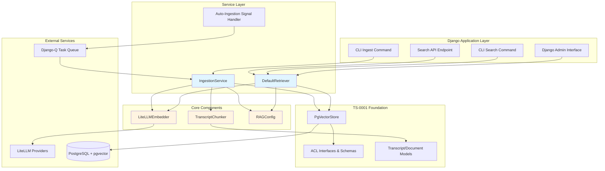
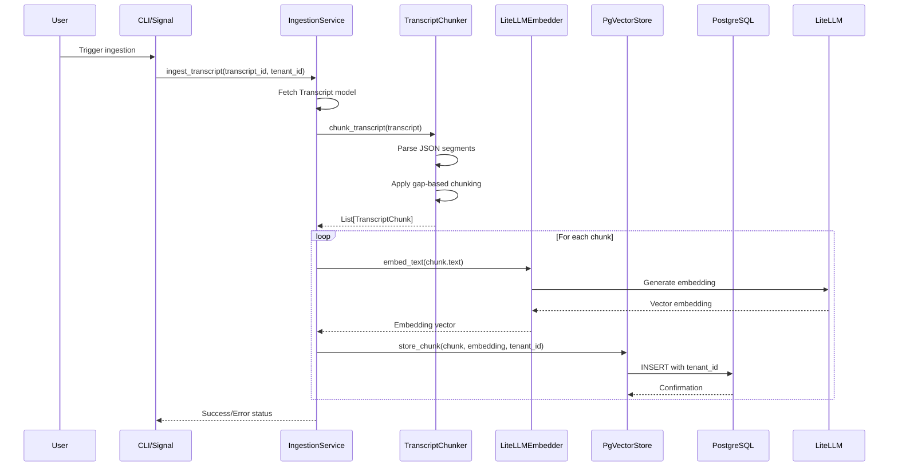
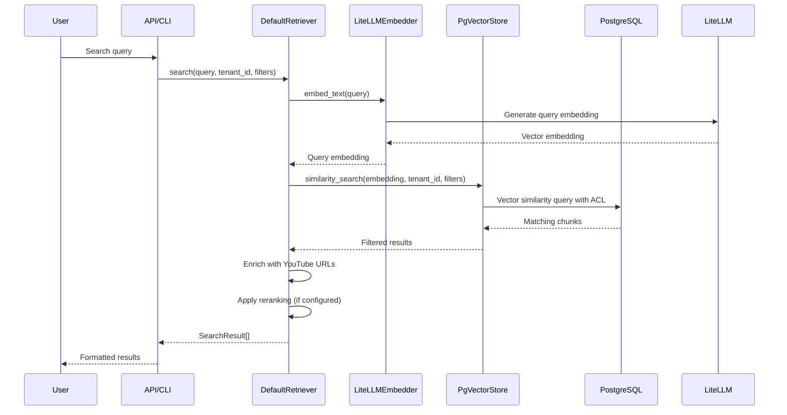

# RAG Transcript Ingestion & Search Architecture

## Overview

This architecture extends the existing `rag/` module to add transcript-specific ingestion and search capabilities. It builds on TS-0001's ACL foundation while introducing intelligent chunking, flexible embedding, and YouTube-aware search features.

## Component Architecture

## Data Flow Diagrams

### Ingestion Pipeline Flow

### Search Flow

## Key Architectural Decisions

### 1. Intelligent Timestamp-Based Chunking

**Decision**: Use transcript segment timestamps and gap detection for chunking instead of fixed character/token limits.

**Rationale**:
- Preserves semantic boundaries (natural speech pauses)
- Maintains temporal coherence for better context
- Enables accurate timestamp-to-video linking
- Avoids mid-sentence splits that harm search quality

**Implementation**: `TranscriptChunker` analyzes segment gaps (>2s default) to identify natural break points.

### 2. LiteLLM Provider Abstraction

**Decision**: Use LiteLLM as an abstraction layer for embedding providers.

**Rationale**:
- Single interface supports multiple providers (OpenAI, local models, etc.)
- Easy switching between development (local) and production (OpenAI)
- Future-proof against provider changes
- Consistent retry/error handling across providers

**Implementation**: `LiteLLMEmbedder` wraps LiteLLM client with configuration-driven provider selection.

### 3. Dependency Injection Pattern

**Decision**: Services accept dependencies via constructor injection (embedder, vector_store, config).

**Rationale**:
- Enables easy testing with mocks
- Decouples components for independent development
- Supports multiple configurations (dev vs. prod)
- Follows Django best practices

**Implementation**: `IngestionService` and `DefaultRetriever` receive dependencies in `__init__`.

### 4. YouTube-Aware Search Results

**Decision**: `DefaultRetriever` enriches results with YouTube timestamp URLs.

**Rationale**:
- Provides direct deep-linking to relevant video moments
- Enhances user experience (click to watch at exact timestamp)
- Leverages existing transcript metadata (video_id, start_time)
- No additional API calls needed

**Implementation**: Generate `https://youtube.com/watch?v={video_id}&t={start_time}` URLs.

### 5. Async Auto-Ingestion via Django-Q

**Decision**: Use Django-Q tasks for automatic ingestion on transcript save.

**Rationale**:
- Avoids blocking HTTP responses during ingestion
- Handles embedding API timeouts gracefully
- Enables retry logic for failed ingestions
- Scales with concurrent transcript uploads

**Implementation**: Signal handler enqueues `ingest_transcript_task` after save.

### 6. Multi-Tenant Security via ACL System

**Decision**: All operations strictly enforce tenant_id filtering via TS-0001's ACL foundation.

**Rationale**:
- Prevents cross-tenant data leakage
- Reuses battle-tested ACL logic from TS-0001
- Consistent security model across features
- Database-level isolation (tenant_id in queries)

**Implementation**: Every `PgVectorStore` operation includes `tenant_id` WHERE clause.

## Component Responsibilities

### TranscriptChunker
- Parse transcript JSON segments
- Identify natural break points via timestamp gaps
- Generate chunks with metadata (start_time, end_time, video_id)
- Enforce max chunk size constraints

### LiteLLMEmbedder
- Abstract embedding provider calls
- Handle authentication and configuration
- Manage retry logic for API failures
- Return consistent vector format

### IngestionService
- Orchestrate end-to-end ingestion pipeline
- Coordinate chunker, embedder, and vector store
- Handle transaction boundaries
- Report ingestion metrics/errors

### DefaultRetriever
- Convert text queries to embeddings
- Execute similarity searches with ACL filtering
- Enrich results with YouTube metadata
- Apply optional reranking

### RAGConfig
- Centralize configuration (providers, thresholds, etc.)
- Environment-based settings (dev vs. prod)
- Validation of required parameters

## Extension Points

1. **Custom Chunkers**: Implement `ChunkerInterface` for alternative strategies
2. **Embedding Providers**: Add new providers via LiteLLM configuration
3. **Retrieval Strategies**: Implement `RetrieverInterface` for hybrid search, reranking, etc.
4. **Ingestion Hooks**: Extend signal handlers for custom pre/post-processing
5. **Admin Customization**: Override Django admin classes for tenant-specific views

## Security Considerations

1. **Tenant Isolation**: All queries filtered by `tenant_id`
2. **API Authentication**: Search endpoints require authenticated users
3. **Input Validation**: Sanitize queries to prevent injection attacks
4. **Rate Limiting**: Protect embedding APIs from abuse
5. **Audit Logging**: Track ingestion and search operations per tenant

## Performance Characteristics

### Ingestion
- **Chunking**: O(n) where n = number of segments
- **Embedding**: O(c * E) where c = chunks, E = embedding API latency
- **Storage**: O(c) database inserts

### Search
- **Embedding**: O(E) single query embedding
- **Vector Search**: O(log n) with pgvector IVFFLAT index
- **Enrichment**: O(k) where k = result count (typically ≤ 10)

## Dependencies on TS-0001

This architecture relies on the following TS-0001 components:

1. **ACL Interfaces**: `ACLContext`, `ACLPolicy` for tenant filtering
2. **ACL Schemas**: `TenantContext` for security contexts
3. **PgVectorStore**: Vector storage with ACL enforcement
4. **Models**: `Transcript`, `Document` Django models
5. **Database Schema**: pgvector extension, tenant_id columns

All TS-0002 components integrate seamlessly with this foundation.
