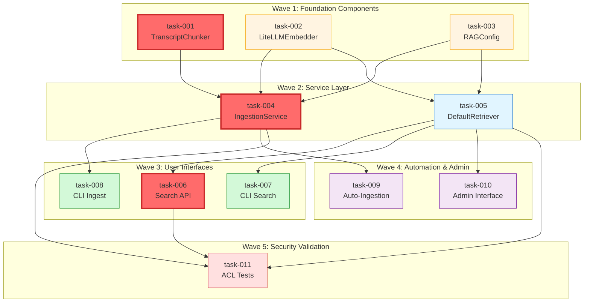

# Task Dependency Graph - TS-0002 RAG Transcript Ingestion

## Task Dependency Diagram



## Wave Breakdown

### Wave 1: Foundation Components (Parallel Execution)
**Tasks**: task-001, task-002, task-003
**Dependencies**: None
**Parallelizable**: Yes - all three tasks can run simultaneously

| Task ID | Component | Description | Estimated Effort |
|---------|-----------|-------------|------------------|
| task-001 | TranscriptChunker | Timestamp-based chunking logic | 4 hours |
| task-002 | LiteLLMEmbedder | Embedding provider abstraction | 3 hours |
| task-003 | RAGConfig | Configuration management | 2 hours |

**Completion Criteria**: All three components implemented with unit tests passing.

### Wave 2: Service Layer (Parallel Execution)
**Tasks**: task-004, task-005
**Dependencies**: Wave 1 complete
**Parallelizable**: Yes - both services can be developed simultaneously

| Task ID | Component | Description | Estimated Effort |
|---------|-----------|-------------|------------------|
| task-004 | IngestionService | Orchestrates ingestion pipeline | 5 hours |
| task-005 | DefaultRetriever | Search and retrieval logic | 4 hours |

**Completion Criteria**: Services integrate with Wave 1 components, integration tests passing.

### Wave 3: User Interfaces (Parallel Execution)
**Tasks**: task-006, task-007, task-008
**Dependencies**: Wave 2 complete
**Parallelizable**: Yes - all three interfaces can be built in parallel

| Task ID | Component | Description | Estimated Effort |
|---------|-----------|-------------|------------------|
| task-006 | Search API | REST endpoint for search | 4 hours |
| task-007 | CLI Search | Management command for search | 2 hours |
| task-008 | CLI Ingest | Management command for ingestion | 2 hours |

**Completion Criteria**: All interfaces functional with end-to-end tests.

### Wave 4: Automation & Admin (Parallel Execution)
**Tasks**: task-009, task-010
**Dependencies**: Wave 2 complete
**Parallelizable**: Yes - signal handler and admin can be developed simultaneously

| Task ID | Component | Description | Estimated Effort |
|---------|-----------|-------------|------------------|
| task-009 | Auto-Ingestion | Django-Q signal-triggered tasks | 3 hours |
| task-010 | Admin Interface | Django admin customization | 3 hours |

**Completion Criteria**: Auto-ingestion triggers correctly, admin interface displays results.

### Wave 5: Security Validation (Sequential)
**Tasks**: task-011
**Dependencies**: Waves 2, 3 complete (tasks 004, 005, 006)
**Parallelizable**: No - requires completed components

| Task ID | Component | Description | Estimated Effort |
|---------|-----------|-------------|------------------|
| task-011 | ACL Tests | Multi-tenant security validation | 4 hours |

**Completion Criteria**: All ACL tests pass, no cross-tenant data leakage.

## Critical Path

The critical path determines the minimum time to complete all tasks:

```
task-001 (4h) → task-004 (5h) → task-006 (4h) → task-011 (4h) = 17 hours
```

**Critical Path Tasks** (highlighted in red on diagram):
1. **task-001**: TranscriptChunker - required by IngestionService
2. **task-004**: IngestionService - required by Search API
3. **task-006**: Search API - required by ACL Tests

**Optimization Opportunities**:
- Parallelize Wave 1: Reduce 9h total to 4h elapsed (longest task)
- Parallelize Wave 2: Reduce 9h total to 5h elapsed (longest task)
- Parallelize Wave 3: Reduce 8h total to 4h elapsed (longest task)
- Parallelize Wave 4: Reduce 6h total to 3h elapsed (longest task)

**Optimized Timeline**: ~17 hours elapsed time vs. 36 hours sequential

## Dependency Matrix

| Task | Depends On | Blocks |
|------|------------|--------|
| task-001 | - | task-004 |
| task-002 | - | task-004, task-005 |
| task-003 | - | task-004, task-005 |
| task-004 | task-001, task-002, task-003 | task-008, task-009, task-011 |
| task-005 | task-002, task-003 | task-006, task-007, task-010, task-011 |
| task-006 | task-005 | task-011 |
| task-007 | task-005 | - |
| task-008 | task-004 | - |
| task-009 | task-004 | - |
| task-010 | task-005 | - |
| task-011 | task-004, task-005, task-006 | - |

## Task Execution Strategy

### Recommended Execution Order

1. **Start Wave 1 in parallel** (3 agents):
   - Agent A: task-001 (TranscriptChunker)
   - Agent B: task-002 (LiteLLMEmbedder)
   - Agent C: task-003 (RAGConfig)

2. **Start Wave 2 in parallel** (2 agents):
   - Agent A: task-004 (IngestionService)
   - Agent B: task-005 (DefaultRetriever)

3. **Start Wave 3 in parallel** (3 agents):
   - Agent A: task-006 (Search API)
   - Agent B: task-007 (CLI Search)
   - Agent C: task-008 (CLI Ingest)

4. **Start Wave 4 in parallel** (2 agents):
   - Agent A: task-009 (Auto-Ingestion)
   - Agent B: task-010 (Admin Interface)

5. **Execute Wave 5 sequentially** (1 agent):
   - Agent A: task-011 (ACL Tests)

### Contract Synchronization Points

Agents must synchronize on contract definitions before proceeding:

- **Before Wave 2**: Confirm `ChunkerInterface`, `EmbedderInterface`, `ConfigInterface`
- **Before Wave 3**: Confirm `IngestionResult`, `SearchResult` data structures
- **Before Wave 5**: Confirm all API contracts and test data fixtures

## Risk Mitigation

### High-Risk Dependencies

1. **task-002 → task-004, task-005**: LiteLLMEmbedder is used by both services
   - **Mitigation**: Define clear `EmbedderInterface` contract in contracts/
   - **Fallback**: Implement mock embedder for testing if LiteLLM integration delayed

2. **task-004 → task-011**: ACL tests depend on IngestionService
   - **Mitigation**: Ensure task-004 includes comprehensive error handling
   - **Fallback**: Create test fixtures if IngestionService incomplete

### Integration Points

1. **Wave 1 → Wave 2**: Contract validation required
2. **Wave 2 → Wave 3/4**: API stability required
3. **Wave 3 → Wave 5**: Search endpoint must be functional

## Verification Checkpoints

### After Wave 1
- [ ] All interfaces defined in contracts/
- [ ] Unit tests pass for all components
- [ ] Mock implementations available for dependent tasks

### After Wave 2
- [ ] Integration tests pass
- [ ] Services successfully use Wave 1 components
- [ ] Database migrations applied

### After Wave 3
- [ ] End-to-end manual tests successful
- [ ] API documentation complete
- [ ] CLI commands functional

### After Wave 4
- [ ] Auto-ingestion triggers correctly
- [ ] Admin interface displays data
- [ ] Performance benchmarks recorded

### After Wave 5
- [ ] All ACL tests pass
- [ ] Security audit complete
- [ ] Feature ready for merge

## Estimated Timeline

| Wave | Tasks | Parallel Agents | Elapsed Time | Sequential Time |
|------|-------|----------------|--------------|-----------------|
| Wave 1 | 3 | 3 | 4 hours | 9 hours |
| Wave 2 | 2 | 2 | 5 hours | 9 hours |
| Wave 3 | 3 | 3 | 4 hours | 8 hours |
| Wave 4 | 2 | 2 | 3 hours | 6 hours |
| Wave 5 | 1 | 1 | 4 hours | 4 hours |
| **Total** | **11** | **-** | **~20 hours** | **36 hours** |

**Note**: Timeline assumes ideal conditions. Add 20-30% buffer for integration debugging and contract alignment.

## Success Metrics

- [ ] All 11 tasks completed
- [ ] Zero cross-tenant data leakage in tests
- [ ] Search API responds in <500ms for typical queries
- [ ] Auto-ingestion processes transcripts within 5 minutes
- [ ] 100% test coverage for security-critical code paths
