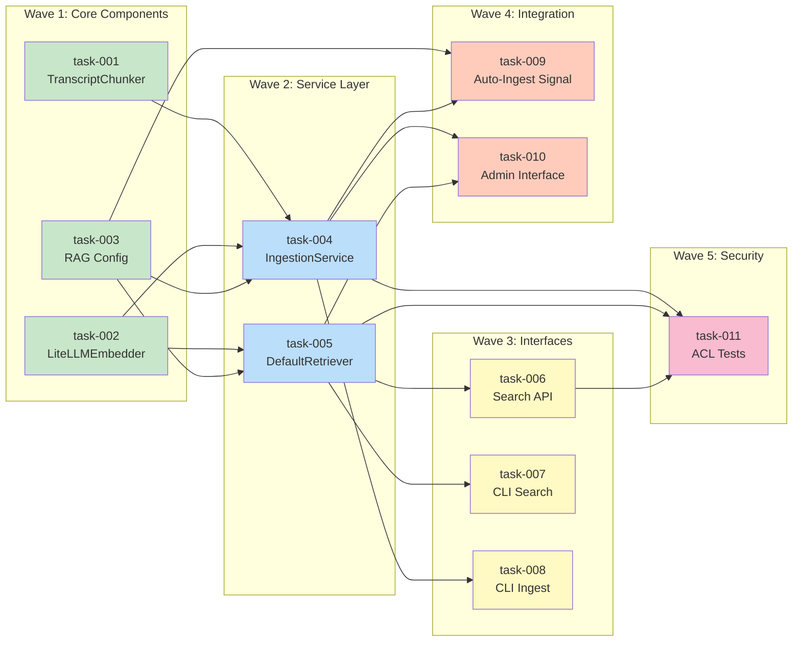

# Task Dependency Graph: TS-0002 RAG Transcript Ingestion

## Wave Overview

| Wave | Tasks | Description | Parallelism | Est. Time |
|------|-------|-------------|-------------|-----------|
| 1 | task-001, task-002, task-003 | Core components (chunker, embedder, config) | 3 | 4-6 hours |
| 2 | task-004, task-005 | Service layer (ingestion, retrieval) | 2 | 6-8 hours |
| 3 | task-006, task-007, task-008 | API & CLI interfaces | 3 | 4-6 hours |
| 4 | task-009, task-010 | Integration (signal, admin) | 2 | 3-4 hours |
| 5 | task-011 | Security and ACL tests | 1 | 2-3 hours |

**Total Sequential Time**: 19-27 hours
**Total Parallel Time**: 8-12 hours (with 3 parallel agents)

## Dependency Diagram



## Detailed Task Dependencies

### Wave 1: Core Components (Parallel: 3)

**task-001-chunker** (TranscriptChunker)
- **Depends on**: None (foundation task)
- **Blocks**: task-004 (IngestionService needs chunker)
- **Deliverables**:
  - `rag/chunkers/transcript.py`
  - `rag/tests/test_chunker.py`
  - Database migration for chunks model
- **Validation**: Unit tests with various timestamp patterns

**task-002-embedder** (LiteLLMEmbedder)
- **Depends on**: None (foundation task)
- **Blocks**: task-004 (ingestion), task-005 (retrieval)
- **Deliverables**:
  - `rag/embedders/litellm.py`
  - `rag/tests/test_embedder.py`
  - Model configuration and caching
- **Validation**: Test with both local and OpenAI models

**task-003-config** (RAG Configuration)
- **Depends on**: None (foundation task)
- **Blocks**: task-004, task-005, task-009 (all services use config)
- **Deliverables**:
  - `rag/config.py`
  - Settings in `config/settings.py`
  - Environment variable documentation
- **Validation**: Config loading tests, default value tests

### Wave 2: Service Layer (Parallel: 2)

**task-004-ingestion** (IngestionService)
- **Depends on**: task-001 (chunker), task-002 (embedder), task-003 (config)
- **Blocks**: task-008 (CLI ingest), task-009 (auto-ingest), task-010 (admin), task-011 (tests)
- **Deliverables**:
  - `rag/services/ingestion.py`
  - `rag/tests/test_ingestion.py`
  - Transaction management and error handling
- **Validation**: Integration tests with real database

**task-005-retriever** (DefaultRetriever)
- **Depends on**: task-002 (embedder), task-003 (config)
- **Blocks**: task-006 (API), task-007 (CLI search), task-010 (admin), task-011 (tests)
- **Deliverables**:
  - `rag/retrievers/default.py`
  - `rag/tests/test_retriever.py`
  - ACL integration with QueryACLContext
- **Validation**: Search tests with ACL enforcement

### Wave 3: Interfaces (Parallel: 3)

**task-006-api** (Search API)
- **Depends on**: task-005 (retriever)
- **Blocks**: task-011 (API security tests)
- **Deliverables**:
  - `rag/api/views.py`
  - `rag/api/serializers.py`
  - URL routing in `rag/urls.py`
  - API documentation
- **Validation**: API integration tests, schema validation

**task-007-cli-search** (CLI Search Command)
- **Depends on**: task-005 (retriever)
- **Blocks**: None (optional interface)
- **Deliverables**:
  - `rag/management/commands/rag_search.py`
  - `rag/tests/test_cli_search.py`
  - User documentation
- **Validation**: CLI tests with various options

**task-008-cli-ingest** (CLI Ingest Command)
- **Depends on**: task-004 (ingestion service)
- **Blocks**: None (optional interface)
- **Deliverables**:
  - `rag/management/commands/rag_ingest.py`
  - `rag/tests/test_cli_ingest.py`
  - User documentation
- **Validation**: CLI tests with batch ingestion

### Wave 4: Integration (Parallel: 2)

**task-009-signal** (Auto-Ingest Signal)
- **Depends on**: task-003 (config), task-004 (ingestion service)
- **Blocks**: task-011 (auto-ingestion tests)
- **Deliverables**:
  - Signal handler in `yt_sync/signals.py`
  - `rag/tests/test_signals.py`
  - Django-Q task integration
- **Validation**: Signal tests with mock video saves

**task-010-admin** (Admin Interface)
- **Depends on**: task-004 (ingestion), task-005 (retriever)
- **Blocks**: None (UI enhancement)
- **Deliverables**:
  - `rag/admin.py`
  - Admin templates (if custom views)
  - `rag/tests/test_admin.py`
- **Validation**: Admin interface manual tests

### Wave 5: Security (Parallel: 1)

**task-011-acl-tests** (ACL Security Tests)
- **Depends on**: task-004 (ingestion), task-005 (retriever), task-006 (API)
- **Blocks**: None (final validation)
- **Deliverables**:
  - `rag/tests/test_acl_security.py`
  - Performance benchmarks
  - Security audit report
- **Validation**: Comprehensive ACL enforcement tests

## Critical Path

The critical path determines the minimum time to complete all tasks:

```
task-001 (chunker)
  → task-004 (ingestion)
    → task-006 (API)
      → task-011 (ACL tests)
```

**Critical Path Duration**:
- task-001: 2 hours
- task-004: 3 hours
- task-006: 2 hours
- task-011: 2 hours
- **Total**: 9 hours (minimum completion time)

## Parallelization Strategy

### Maximum Parallelism: 3 (Wave 1 and Wave 3)

**Optimal Agent Assignment:**

**Agent 1 (Primary Backend):**
1. task-001 (chunker)
2. task-004 (ingestion service)
3. task-008 (CLI ingest)
4. task-011 (ACL tests)

**Agent 2 (Search & Retrieval):**
1. task-002 (embedder)
2. task-005 (retriever)
3. task-006 (API)
4. task-010 (admin)

**Agent 3 (Config & Integration):**
1. task-003 (config)
2. Wait for task-005 completion
3. task-007 (CLI search)
4. task-009 (auto-ingest signal)

### Synchronization Points

**Sync Point 1 (End of Wave 1):**
- All agents must complete tasks 001, 002, 003
- Contracts validated: chunker output, embedder interface, config schema
- Proceed to Wave 2

**Sync Point 2 (End of Wave 2):**
- Agents 1 and 2 must complete tasks 004, 005
- Integration tests: ingestion + retrieval pipeline
- Proceed to Wave 3

**Sync Point 3 (End of Wave 3):**
- All agents complete their interface tasks
- API contract validation
- Proceed to Wave 4

**Sync Point 4 (End of Wave 4):**
- Integration tasks complete
- Full system smoke test
- Proceed to Wave 5

**Final Sync (End of Wave 5):**
- Security tests pass
- All contracts validated
- Feature complete

## Risk Analysis

### High-Risk Dependencies

1. **task-002 → task-004, task-005**
   - **Risk**: Embedder issues block both ingestion and retrieval
   - **Mitigation**: Prioritize embedder completion, include mock for testing
   - **Impact**: Critical (blocks 7 downstream tasks)

2. **task-004 → task-008, task-009, task-010, task-011**
   - **Risk**: Ingestion service issues block multiple interfaces
   - **Mitigation**: Comprehensive unit tests, early integration testing
   - **Impact**: High (blocks 4 downstream tasks)

3. **task-005 → task-006, task-007, task-010, task-011**
   - **Risk**: Retriever issues block search interfaces
   - **Mitigation**: Mock retriever for interface development
   - **Impact**: High (blocks 4 downstream tasks)

### Low-Risk Dependencies

1. **task-003 → task-004, task-005**
   - **Risk**: Config issues easy to fix
   - **Mitigation**: Simple fallback defaults
   - **Impact**: Low (easy to fix)

2. **task-009, task-010**
   - **Risk**: Integration tasks are nice-to-have
   - **Mitigation**: Can be deferred if needed
   - **Impact**: Low (optional features)

## Contract Validation Points

### After Wave 1
- **Chunker Output Schema**: Verify `TranscriptChunk` dataclass structure
- **Embedder Interface**: Test `embed()` and `embed_batch()` signatures
- **Config Schema**: Validate all RAG_* settings load correctly

### After Wave 2
- **Ingestion Pipeline**: End-to-end test from transcript to pgvector
- **Search Pipeline**: End-to-end test from query to enriched results
- **ACL Integration**: Verify QueryACLContext correctly filters videos

### After Wave 3
- **API Contract**: OpenAPI schema validation
- **CLI Contract**: Command-line argument parsing tests
- **Response Format**: JSON schema validation for all interfaces

### After Wave 4
- **Signal Contract**: Verify signal fires on video save
- **Admin Contract**: Verify admin actions work correctly
- **Queue Integration**: Verify Django-Q tasks execute properly

### Final Validation
- **Security Contract**: ACL enforcement tests pass
- **Performance Contract**: Search latency < 500ms for 90th percentile
- **Data Integrity**: No orphaned chunks or embeddings

## Integration Testing Strategy

### Wave 1 Integration
```python
def test_wave1_integration():
    # Verify contracts between core components
    chunker = TranscriptChunker()
    embedder = LiteLLMEmbedder()
    config = RAGConfig()

    chunks = chunker.chunk(sample_transcript)
    embeddings = embedder.embed_batch([c.text for c in chunks])

    assert len(chunks) == len(embeddings)
    assert embeddings[0].shape == (config.embedding_dimensions,)
```

### Wave 2 Integration
```python
def test_wave2_integration():
    # Verify end-to-end pipeline
    video = create_test_video()
    ingestion_service.ingest(video)

    results = retriever.search("test query", user=test_user)

    assert len(results) > 0
    assert all(r.video.accessible_by(test_user) for r in results)
```

### Wave 3 Integration
```python
def test_wave3_integration():
    # Verify all interfaces work
    api_response = client.post('/api/rag/search/', {'query': 'test'})
    cli_output = call_command('rag_search', 'test')

    assert api_response.status_code == 200
    assert 'results' in api_response.json()
    assert 'results' in cli_output
```

### Wave 4 Integration
```python
def test_wave4_integration():
    # Verify auto-ingestion and admin
    video = Video.objects.create(...)
    video.transcript = "test transcript"
    video.save()  # Should trigger signal

    # Wait for async task
    assert TranscriptChunk.objects.filter(video=video).exists()

    # Verify admin
    admin_client.post(f'/admin/rag/chunk/{chunk.id}/re-ingest/')
```

### Final Integration
```python
def test_final_integration():
    # Comprehensive end-to-end test
    # 1. Create video with ACL restrictions
    # 2. Ingest transcript
    # 3. Search as different users
    # 4. Verify ACL enforcement
    # 5. Verify performance
    pass
```

## Rollback Strategy

If critical issues are discovered:

1. **After Wave 1**: Minimal rollback needed (only migrations)
2. **After Wave 2**: Rollback database migrations, remove models
3. **After Wave 3**: Rollback API routes, CLI commands
4. **After Wave 4**: Disconnect signals, hide admin interface
5. **After Wave 5**: Full feature flag to disable RAG system

## Success Criteria

### Wave 1 Complete
- [ ] All unit tests pass
- [ ] Contracts validated
- [ ] Database migrations applied
- [ ] No blocking issues

### Wave 2 Complete
- [ ] Integration tests pass
- [ ] Ingestion pipeline works end-to-end
- [ ] Search pipeline works end-to-end
- [ ] ACL enforcement verified

### Wave 3 Complete
- [ ] API tests pass
- [ ] CLI commands work
- [ ] Documentation updated
- [ ] No API contract breaks

### Wave 4 Complete
- [ ] Signal fires correctly
- [ ] Admin interface functional
- [ ] Django-Q tasks execute
- [ ] No integration issues

### Wave 5 Complete (Feature Complete)
- [ ] All ACL tests pass
- [ ] Performance benchmarks met
- [ ] Security audit passed
- [ ] Ready for production deployment
