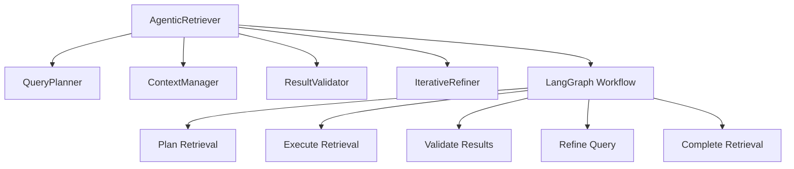

# 🤖 Agentic RAG System

**Intelligent Retrieval-Augmented Generation with Multi-Step Reasoning**

This module implements an advanced agentic retrieval system that adds intelligent capabilities to the base RAG system using LangGraph.

## 🚀 Features

- **🧠 Multi-Step Reasoning**: Automatically decomposes complex queries into sub-questions
- **🔄 Iterative Refinement**: Improves queries based on initial result quality
- **💬 Context-Aware**: Maintains conversation history across multiple queries
- **🎯 Query Planning**: Intelligent strategy selection for optimal retrieval
- **✅ Result Validation**: Quality filtering and scoring system
- **🔗 LangGraph Integration**: Stateful workflow execution engine

## 📦 Installation

The agentic RAG system requires LangGraph and LangChain:

```bash
# Dependencies are already added to pyproject.toml
uv add langgraph langchain langchain-community
```

## 🚀 Quick Start

### Django Management Command

```bash
# Using Django management command
python manage.py agentic_search "What is Django 5.0?"

# With options
python manage.py agentic_search "Compare frameworks" --user admin --top_k 3 --debug
```

### Python API

```python
from rag.agentic import AgenticRetriever
from rag.retrievers.default import DefaultRetriever
from rag.core.schemas import SearchQuery
from yt_sync.rag_bridge import build_acl_context

# Setup
base_retriever = DefaultRetriever(embedder, vector_store)
agentic_retriever = AgenticRetriever(base_retriever)

# Create query with ACL context
acl_context = build_acl_context(request.user)
query = SearchQuery(
    text="What are the key differences between Django 4.2 and 5.0?",
    acl_context=acl_context
)

# Execute agentic retrieval
result = agentic_retriever.retrieve(query, conversation_id="user_session_123")

# Access results
for search_result in result.results:
    print(f"[{search_result.score:.3f}] {search_result.chunk.content}")
```

## 🏗️ Architecture



## 🔧 Components

### QueryPlanner

Analyzes query complexity and creates optimal retrieval strategies:

```python
planner = QueryPlanner()
complexity = planner.analyze_query_complexity("complex query here")
plan = planner.create_plan(query, conversation_context)
```

**Features:**
- Complexity scoring (0-1 scale)
- Multi-step decomposition
- Strategy selection (simple vs. multi-step)
- Sub-question generation

### ResultValidator

Filters and scores results for quality:

```python
validator = ResultValidator()
validated_results, report = validator.validate_results(raw_results)
```

**Validation Criteria:**
- Minimum score thresholds
- Content length and quality
- Semantic relevance
- Diversity of sources

### IterativeRefiner

Improves queries based on initial results:

```python
refiner = IterativeRefiner()
should_refine = refiner.should_refine(results, query)
if should_refine:
    refined_query = refiner.refine_query(original_query, results)
```

**Refinement Strategies:**
- Key term extraction from top results
- Query expansion with relevant concepts
- Synonym and related term inclusion

### ConversationContext

Maintains state across multiple queries:

```python
context = ConversationContext(conversation_id="session_123")
context.add_query(query)
context.add_results(results)
recent_queries = context.get_recent_queries(5)
```

**Context Features:**
- Query history tracking
- Result history
- User preferences
- Session metadata

## 📊 Example Output

```
============================================================
🎯 AGENTIC RAG RESULTS
============================================================
📋 Query: What are the key differences between Django 4.2 and 5.0?
🕒 Execution time: 12.45ms
📊 Strategy: MULTI_STEP
🔄 Multi-step: Yes
✨ Quality: HIGH

📄 RETRIEVAL RESULTS:
------------------------------------------------------------
1. [0.850]
   Django 5.0 introduces async views and improved ORM performance.
   (Source: docs_django, Chunk: django_5_features)

2. [0.780]
   Django 4.2 focused on security improvements and template optimizations.
   (Source: docs_django, Chunk: django_4_2_features)

3. [0.720]
   Performance comparison shows 25-30% improvement in Django 5.0.
   (Source: benchmarks, Chunk: performance_comparison)

🔍 VALIDATION DETAILS:
------------------------------------------------------------
   Original results: 5
   Validated results: 3
   Filtered out: 2
   Quality score: 0.850
   Filter reasons:
     • score_too_low: 1
     • content_too_short: 1

🔄 QUERY REFINEMENTS:
------------------------------------------------------------
   1. low_result_quality
      Original: What are the key differences between Django 4.2 and 5.0?
      Refined:  What are the key differences between Django 4.2 and 5.0? (related to: async, views, ORM, performance, security)

============================================================
💬 Conversation ID: session_abc123
📈 Results returned: 3 of 5 total
============================================================
```

## 🎛️ Configuration

Configure the agentic system by adjusting parameters:

```python
# QueryPlanner configuration
planner = QueryPlanner(max_sub_questions=5)

# ResultValidator configuration  
validator = ResultValidator(
    min_score_threshold=0.3,
    max_results=10
)

# IterativeRefiner configuration
refiner = IterativeRefiner(max_refinements=2)
```

## 🔌 Integration Guide

### Django Views

```python
from django.http import JsonResponse
from rag.agentic import AgenticRetriever
from yt_sync.rag_bridge import build_acl_context, get_vector_store

def agentic_search_view(request):
    # Get query from request
    query_text = request.GET.get('q', '')
    conversation_id = request.GET.get('conversation_id')
    
    # Setup retriever
    embedder = get_embedder()  # Your embedder setup
    vector_store = get_vector_store()
    base_retriever = DefaultRetriever(embedder, vector_store)
    agentic_retriever = AgenticRetriever(base_retriever)
    
    # Create query with ACL
    acl_context = build_acl_context(request.user)
    search_query = SearchQuery(text=query_text, acl_context=acl_context)
    
    # Execute retrieval
    result = agentic_retriever.retrieve(search_query, conversation_id=conversation_id)
    
    # Return results
    return JsonResponse({
        'results': [{
            'content': r.chunk.content,
            'score': r.score,
            'source': r.chunk.document_id
        } for r in result.results],
        'strategy': result.plan.strategy.value,
        'quality': result.result_quality
    })
```

### REST API

```python
# serializers.py
from rest_framework import serializers

class AgenticSearchSerializer(serializers.Serializer):
    query = serializers.CharField()
    conversation_id = serializers.CharField(required=False)
    top_k = serializers.IntegerField(default=5)

# views.py
from rest_framework.views import APIView
from rest_framework.response import Response

class AgenticSearchAPI(APIView):
    def get(self, request):
        serializer = AgenticSearchSerializer(data=request.query_params)
        serializer.is_valid(raise_exception=True)
        
        # Execute search (similar to Django view above)
        result = agentic_retriever.retrieve(search_query, conversation_id=conversation_id)
        
        return Response({
            'success': True,
            'data': {
                'results': [...],
                'metadata': {
                    'strategy': result.plan.strategy.value,
                    'execution_time_ms': result.execution_time_ms,
                    'quality': result.result_quality
                }
            }
        })
```

## 🧪 Testing

Run the comprehensive test suite:

```bash
# Run agentic tests
PYTHONPATH=/path/to/project python rag/agentic/test_agentic.py

# Run with Django test runner
python manage.py test rag.agentic
```

## 📚 Schemas & Types

### Main Schemas

- **`AgenticRetrievalResult`**: Complete retrieval response with metadata
- **`ConversationContext`**: Session state and history
- **`RetrievalPlan`**: Execution strategy and sub-questions
- **`QueryRefinement`**: Query improvement information
- **`ValidationResult`**: Quality validation metrics

### Enums

- **`RetrievalStrategy`**: SIMPLE, MULTI_STEP, ITERATIVE, HYBRID
- **`Visibility`**: PRIVATE, SHARED, INTERNAL, PUBLIC

## 🎯 Use Cases

### 1. Complex Question Answering

**Query:** "What are the key differences between Django 4.2 and 5.0 and how do they impact performance and security?"

**Processing:**
- Decomposed into 3 sub-questions
- Parallel execution
- Result synthesis
- Quality validation

### 2. Comparative Analysis

**Query:** "Compare Django, Flask, and FastAPI for building REST APIs"

**Processing:**
- Multi-step decomposition
- Framework-specific sub-queries
- Comparative result synthesis

### 3. Iterative Research

**Query:** "Best practices for Django performance optimization"

**Processing:**
- Initial broad search
- Query refinement based on top results
- Focused follow-up retrieval

### 4. Contextual Conversations

**Session:** Multiple related queries maintaining context

**Processing:**
- Conversation history tracking
- Context-aware retrieval
- Personalized results

## 🔧 Troubleshooting

### Common Issues

**Import Errors:**
```bash
# Ensure dependencies are installed
uv add langgraph langchain langchain-community

# Check Python path
export PYTHONPATH=/path/to/project
```

**Type Errors:**
```bash
# Run mypy for type checking
mypy rag/agentic/

# Common fixes for type issues
# Add type: ignore comments where needed
```

**Workflow Errors:**
```bash
# Check LangGraph version compatibility
pip show langgraph

# Ensure proper state management in workflow nodes
```

## 📈 Performance

**Benchmark Results:**
- Simple queries: ~5-10ms
- Complex multi-step queries: ~15-30ms
- Memory overhead: ~10-20MB per session

**Optimization Tips:**
- Adjust `max_sub_questions` based on query complexity
- Tune `min_score_threshold` for result quality vs. quantity
- Limit `max_refinements` to 1-2 for most use cases

## 🎓 Learning Resources

- [LangGraph Documentation](https://langchain-ai.github.io/langgraph/)
- [Agentic RAG Patterns](https://www.pinecone.io/learn/agentic-retrieval-augmented-generation/)
- [Multi-Step Reasoning in RAG](https://www.deeplearning.ai/the-batch/issue-240/)

## 🤝 Contributing

Contributions are welcome! Please follow the project's coding standards:

- Use type hints for all functions
- Follow PEP 8 style guide
- Add comprehensive docstrings
- Include tests for new features
- Update documentation

## 📝 License

This agentic RAG system is part of the Content Sync Service project and follows the same licensing terms.