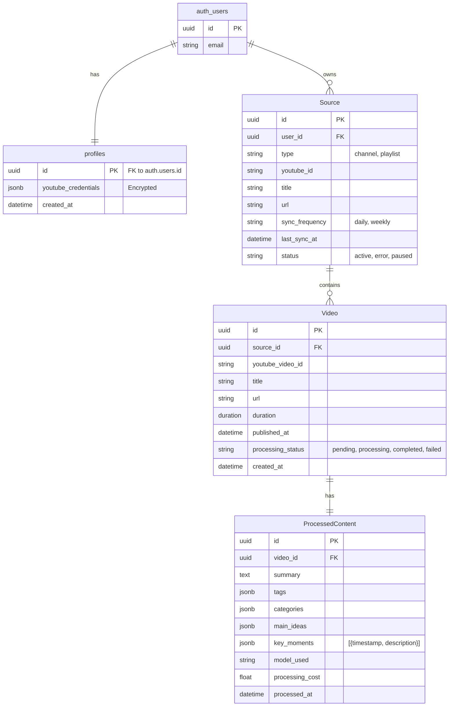

# ContentSync Database Schema

## ER Diagram

## Table Definitions

### 1. Users (Managed by Supabase Auth)
- The `auth.users` table is managed internally by Supabase.
- We reference `auth.users.id` (UUID) in our tables.

### 2. Profiles (`public.profiles`)
Stores application-specific user data.
- **id**: UUID, Primary Key (References `auth.users.id` 1:1).
- **email**: String (Synced from Auth).
- **youtube_credentials**: JSONB, Encrypted. Stores OAuth tokens or API keys for YouTube access.
- **created_at**: Datetime.

### 3. Sources (`content_source`)
Represents a YouTube channel or playlist being monitored.
- **user_id**: UUID (References `auth.users.id`).
- **youtube_id**: String, External ID (Channel ID or Playlist ID).
- **type**: Enum (CHANNEL, PLAYLIST).
- **Unique Constraint**: `(user, youtube_id)` - prevent duplicate subscriptions.

### 4. Videos (`content_video`)
Individual video items found in a source.
- **source**: ForeignKey to Source.
- **youtube_video_id**: String, Unique Index.
- **transcript_text**: Text. Full transcript content.
- **transcript_status**: Enum (PENDING, PROCESSING, COMPLETED, FAILED). Status of transcript extraction.
- **ai_analysis_status**: Enum (PENDING, PROCESSING, COMPLETED, FAILED). Status of LLM processing.
- **Index**: `(source, published_at DESC)` for efficient "latest videos" queries.

### 5. Processed Content (`content_processedcontent`)
The AI-generated insights for a video.
- **video**: OneToOneField to Video.
- **key_moments**: JSONB. Structure: `[{ "timestamp": "HH:MM:SS", "text": "..." }]`.
- **tags**: ArrayField or JSONB.

## Indexing Strategy
- **Users**: `email` (Unique).
- **Sources**: `(user_id, status)` for listing active sources.
- **Videos**: `youtube_video_id` (Unique), `(source_id, published_at)` for ordering.
- **ProcessedContent**: `video_id` (Unique).
