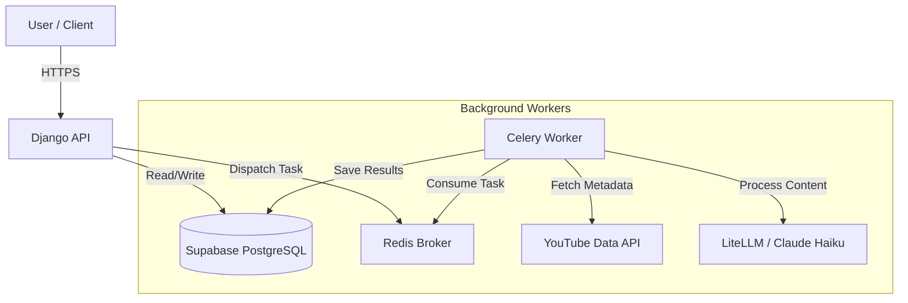

# ContentSync Technical Specification

## 1. System Architecture

### Overview
ContentSync is built as a monolithic Django application with a strong separation between the synchronous API layer and the asynchronous background processing layer.

### Components
- **API Layer**: Django REST Framework (DRF) application serving REST endpoints.
- **Task Queue**: Celery workers handling long-running tasks (video fetching, transcript extraction, LLM processing).
- **Message Broker**: Redis for Celery task routing.
- **Database**: Supabase (PostgreSQL) for persistent storage.
- **AI Gateway**: LiteLLM for unified access to LLM providers (Claude Haiku).
- **External APIs**: YouTube Data API v3.

### High-Level Diagram


## 2. API Specification

### Authentication
- **Mechanism**: Supabase Auth (JWT).
- **Header**: `Authorization: Bearer <SUPABASE_JWT>`
- **Validation**: Django middleware verifies the JWT signature using the Supabase project secret.
- **Scope**: All endpoints require a valid JWT.

### Endpoints

#### Sources
- `POST /api/sources/`
    - **Purpose**: Subscribe to a new YouTube channel or playlist.
    - **Body**: `{ "url": "https://youtube.com/...", "sync_frequency": "daily" }`
    - **Response**: `201 Created` with Source object.
- `GET /api/sources/`
    - **Purpose**: List all monitored sources.
    - **Response**: `200 OK` with list of Source objects.
- `DELETE /api/sources/{id}/`
    - **Purpose**: Stop monitoring and remove a source.
    - **Response**: `204 No Content`.

#### Videos
- `GET /api/videos/`
    - **Purpose**: List processed videos with filtering options.
    - **Params**: `source_id`, `transcript_status`, `ai_analysis_status`, `search` (text query).
    - **Response**: `200 OK` with paginated list of Video objects.
- `GET /api/videos/{id}/`
    - **Purpose**: Get detailed analysis of a specific video.
    - **Response**: `200 OK` with Video object including `processed_content`.

#### Search
- `GET /api/search/`
    - **Purpose**: Full-text search across processed content.
    - **Params**: `q` (query string).
    - **Response**: `200 OK` with list of matching Video objects and snippets.

## 3. Background Processing (Celery)

### Queues
- `default`: General tasks.
- `priority`: User-initiated immediate syncs.
- `long_running`: Transcript extraction and LLM processing.

### Core Tasks
1.  **`sync_sources_task`** (Periodic):
    - Runs every hour/day.
    - Iterates through active Sources.
    - Dispatches `fetch_source_videos_task` for each.
2.  **`fetch_source_videos_task(source_id)`**:
    - Calls YouTube API to get latest videos.
    - Creates `Video` records if they don't exist.
    - Dispatches `process_video_pipeline_task` for new videos.
3.  **`process_video_pipeline_task(video_id)`**:
    - **Step 1**: `extract_transcript_task` - Fetches transcript via YouTube API.
    - **Step 2**: `generate_summary_task` - Sends transcript to Claude Haiku via LiteLLM.
    - **Step 3**: `save_results_task` - Stores structured data in `ProcessedContent`.

## 4. LLM Processing Pipeline

### Model
- **Provider**: Anthropic via LiteLLM.
- **Model**: `claude-3-haiku-20240307` (Chosen for speed/cost balance).

### Structured Output Schema
The LLM will be prompted to return JSON adhering to this schema:
```json
{
  "summary": "Concise TL;DR of the video...",
  "tags": ["tag1", "tag2"],
  "categories": ["Education", "Tech"],
  "main_ideas": ["Idea 1", "Idea 2"],
  "key_moments": [
    {"timestamp": "00:01:30", "description": "Introduction to the topic"},
    {"timestamp": "00:05:45", "description": "Deep dive into architecture"}
  ]
}
```

## 5. Security & Compliance

### Data Privacy
- **Isolation**: All database queries are scoped by `user_id`.
- **Encryption**: YouTube API credentials (if stored) are encrypted at rest using `django-fernet-fields`.

### YouTube Compliance
- **Attribution**: All API responses returning video data must include a link to the original YouTube video.
- **Data Deletion**: Webhook (future) or periodic check to remove data if the original video is deleted from YouTube.
- **Transcript Storage**: We store raw transcripts to enable re-processing and search. We must strictly honor YouTube's requirement to delete this content if the video is removed or if the API client's access is revoked.

### Rate Limiting
- **API**: Throttled at 100 requests/minute per user.
- **YouTube API**: Strictly monitored to stay within the 10,000 unit daily quota.
